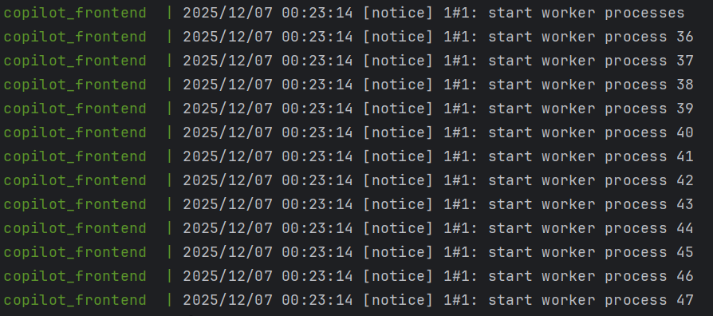
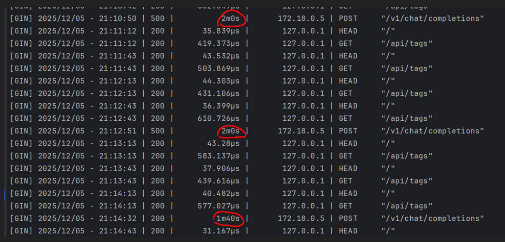
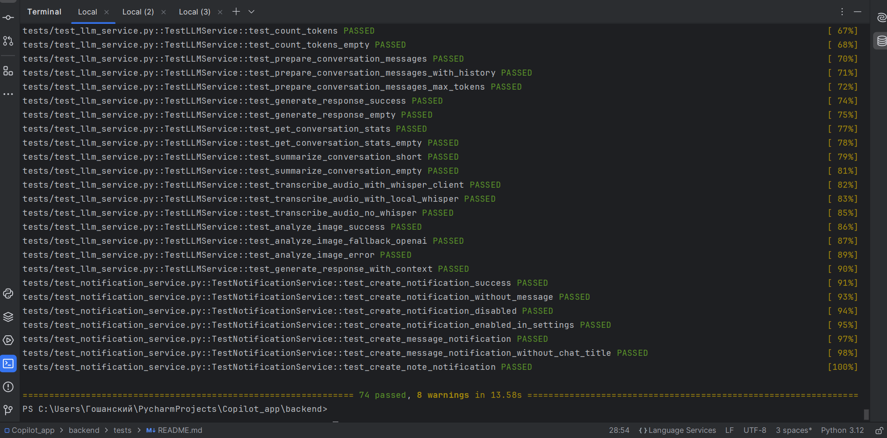
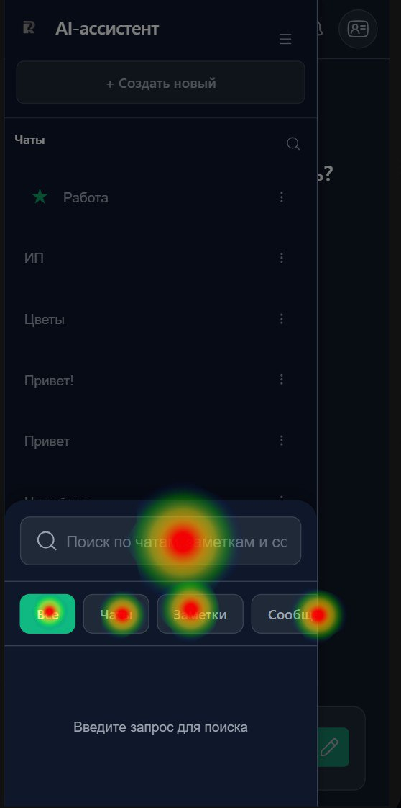
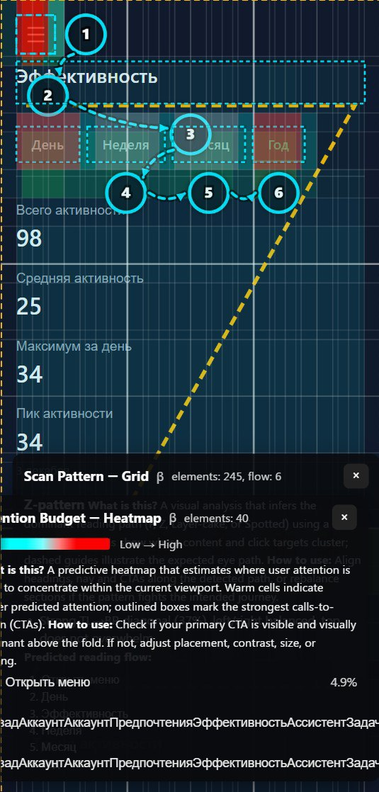

# Copilot App - AI Бизнес-Ассистент


**AI-ассистент для бизнес-консультаций с интеллектуальной классификацией вопросов**

Веб-приложение для получения консультаций по бизнесу с использованием искусственного интеллекта. Система автоматически классифицирует вопросы по категориям (маркетинг, финансы, юриспруденция, управление, продажи) и предоставляет релевантные ответы.

---

## Оглавление

- [Описание проекта](#описание-проекта)
- [Запуск проекта](#запуск-проекта)
- [Архитектура системы](#архитектура-системы)
- [Основной функционал](#основной-функционал)
- [Технологический стек](#технологический-стек)
- [Конфигурация](#конфигурация)
- [Структура проекта](#структура-проекта)
- [API документация](#api-документация)
- [ML модуль](#ml-модуль)
- [Интеграции LLM и AI](#интеграции-llm-и-ai)
- [Документация](#документация)

---

## Описание проекта

Copilot App - это полнофункциональная платформа для бизнес-консультаций, которая объединяет:

- **AI-чат** - интеллектуальный диалог с классификацией вопросов по категориям
- **Рабочие пространства** - организация чатов и заметок по проектам
- **Заметки** - создание и управление бизнес-заметками
- **Универсальный поиск** - поиск по чатам, заметкам и сообщениям
- **Система поддержки** - обратная связь и справочные статьи
- **Настройки уведомлений** - управление уведомлениями по пространствам
- **Публичные пространства** - общий доступ к пространствам через токены
- **Аналитика** - отслеживание эффективности и активности пользователя
- **Удобный UX-интерфейс** - переключение темы приложения, изменения иконок чатов при переключении в режим нижней панели (передвижная кнопка справа)
- **Адаптив для мобильных устройств** - возможность использования приложения на телефоне

## Запуск проекта

### Предварительные требования

- **Docker** >= 20.10
- **Docker Compose** >= 4.40
- **Python** >= 3.11 (для локальной разработки)
- **Node.js** >= 18 (для локальной разработки frontend)

### Переменные окружения

Создайте файл `.env` в корне проекта:

```env
OPENROUTER_API_KEY=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
POSTGRES_USER=copilot_user
POSTGRES_PASSWORD=copilot_pass
POSTGRES_DB=copilot_db

APP_URL=http://localhost
APP_DOMAIN=localhost
ENABLE_SSL=true
```

### Запуск

#### 1. Клонирование репозитория

```bash
git clone https://github.com/ResonanceTECH/Copilot_app.git
cd Copilot_app
```

#### 2. Настройка переменных окружения

Создайте `.env` файл с необходимыми переменными (см. выше).

#### 3. Запуск через Docker Compose

```bash
docker compose up --build
```

Это запустит:
- **PostgreSQL** - база данных
- **Ollama** - локальный LLM сервер (если USE_OLLAMA=true)
- **Whisper** - сервис транскрибации
- **Backend** - FastAPI приложение
- **Frontend** - React приложение через nginx

Проверить запуск контейнеров можно через команду:
```shell
docker ps
```
Или по принципу "фронтенд запускается последним" :)

То есть, когда мы видим эти логи:

все запустилось.

#### 5. Доступ к сервисам

После запуска сервисы будут доступны:

- **Frontend**: `http://localhost` (через nginx)
- **Backend API**: `http://localhost:8000/api`
- **Swagger документация**: `http://localhost:8000/api/docs`
- **ReDoc документация**: `http://localhost:8000/api/redoc`
- **PostgreSQL**: `localhost:5431` (для внешнего доступа)
- **Ollama**: `http://localhost:11434` (если запущен)
- **Whisper**: `http://localhost:9000` (если запущен)

#### 6. Примечание
В случае возникновения случайных ошибок при использовании чата (например, чат не найден), перейдите в новый чат.

## Ключевые возможности

- Автоматическая классификация бизнес-вопросов с помощью ML
- Контекстные ответы на основе истории диалога (понимает контекст в истории из 15 сообщений)
- Организация работы через пространства
- Markdown-поддержка в ответах ассистента
- Многоязычный интерфейс (русский/английский)
- Поддержка мультимодальных запросов (текст, аудио, изображения, файлы)
- Генерация графиков и визуализаций данных
- Анализ файлов (PDF, DOCX, изображения)
- Транскрибация аудио через Whisper
- Публичный доступ к пространствам (через кнопку "Экспорт" в пространствах)

---

Если что, решение развернуто на: https://158.160.165.223

## Архитектура системы

Проект состоит из следующих компонентов:

```
┌─────────────────────────────────────────────────────────┐
│                    Frontend (React)                     │
│              React 18 + TypeScript + Vite               │
│      Порт: 80 (nginx + Самописный ssl-сертификат)       │
└──────────────┬──────────────────────────────────────────┘
               │
               │ HTTP/REST API
               │
┌──────────────▼──────────────────────────────────────────┐
│              Backend (FastAPI)                          │
│         FastAPI + SQLAlchemy + PostgreSQL               │
│                    Порт: 8000                           │
│                                                         │
│  ┌──────────────────────────────────────────────────┐   │
│  │  Routes:                                         │   │
│  │  - /api/auth         - Аутентификация            │   │
│  │  - /api/chat         - Чат с AI                  │   │
│  │  - /api/spaces       - Рабочие пространства      │   │
│  │  - /api/notes        - Заметки                   │   │
│  │  - /api/search       - Универсальный поиск       │   │
│  │  - /api/support      - Поддержка                 │   │
│  │  - /api/notifications - Уведомления              │   │
│  │  - /api/public       - Публичный доступ          │   │
│  │  - /api/user         - Профиль пользователя      │   │
│  └──────────────────────────────────────────────────┘   │
│                                                         │
│  ┌──────────────────────────────────────────────────┐   │
│  │  Services:                                       │   │
│  │  - LLMService          - Интеграция с LLM        │   │
│  │  - ConversationManager - Управление диалогами    │   │
│  │  - ClassifierService   - ML классификация        │   │
│  │  - FileAnalysisService - Анализ файлов           │   │
│  │  - GraphicService      - Генерация графиков      │   │
│  │  - CacheService        - Кэширование             │   │
│  │  - FormattingService   - Форматирование          │   │
│  └──────────────────────────────────────────────────┘   │
└──────────────┬──────────────────────────────────────────┘
               │
               │ SQL
               │
┌──────────────▼──────────────────────────────────────────┐
│              PostgreSQL Database                        │
│              Порт: 5431 (host) / 5432 (container)       │
└─────────────────────────────────────────────────────────┘

┌─────────────────────────────────────────────────────────┐
│              ML Module (Machine Learning)               │
│         RandomForestClassifier + scikit-learn           │
│                                                         │
│  - Классификация вопросов по 7 категориям               │
│  - Обучение на датасете из 600 примеров                 │
│  - Извлечение признаков из текста                       │
└─────────────────────────────────────────────────────────┘

┌─────────────────────────────────────────────────────────┐
│              LLM Services (Docker Compose)              │
│                                                         │
│  - Ollama (локальный LLM) - Порт 11434                  │
│  - Whisper (транскрибация) - Порт 9000                  │
└─────────────────────────────────────────────────────────┘
```

### Компоненты:

1. **Frontend** - React-приложение с TypeScript для веб-интерфейса
2. **Backend** - FastAPI сервер для REST API
3. **PostgreSQL** - Реляционная база данных
4. **ML Module** - Модуль машинного обучения для классификации
5. **Ollama** - Локальный LLM сервер (опционально)
6. **Whisper** - Сервис транскрибации аудио (опционально)
7. **OpenRouter/OpenAI** - Внешние LLM API (опционально)
8. **Nginx** - обратный proxy-сервер с поддержкой самописных сертификатов

---

## Основной функционал

### AI-Чат

- **Интеллектуальный диалог**
  - Отправка вопросов AI-ассистенту
  - Получение контекстных ответов с учетом истории
  - Поддержка Markdown в ответах
  - Индикатор "Поиск и формирование ответа"
  - Управление контекстом диалога (ограничение по токенам)

- **Мультимодальные возможности**
  - Текстовая переписка
  - Голосовые сообщения (транскрибация через Whisper)
  - Загрузка и анализ файлов (PDF, DOCX, изображения)
  - Анализ изображений через vision-модели
  - Генерация графиков и визуализаций данных

- **Управление чатами**
  - Создание новых чатов
  - Переименование чатов
  - Удаление чатов
  - История сообщений с пагинацией
  - Теги для сообщений
  - Обратная связь по сообщениям (лайки/дизлайки)

- **Классификация вопросов**
  - Автоматическое определение категории вопроса
  - 7 категорий: marketing, finance, legal, management, sales, general, graphic
  - Улучшенные промпты на основе категории
  - Кэширование ответов для похожих вопросов

### Рабочие пространства

- **Управление пространствами**
  - Создание рабочих пространств
  - Архивация/разархивирование пространств
  - Добавление чатов в пространство
  - Публичный доступ через токены

- **Публичные пространства**
  - Генерация публичных токенов доступа
  - Просмотр публичных пространств без авторизации
  - Отправка сообщений в публичные чаты
  - Просмотр заметок и тегов публичных пространств

- **Организация контента**
  - Группировка чатов по пространствам
  - Создание заметок в пространствах
  - Просмотр статистики (чаты, заметки, теги)
  - Управление тегами пространства

### Заметки

- **Создание и редактирование**
  - Создание заметок с заголовком и содержимым
  - Редактирование существующих заметок
  - Удаление заметок
  - Привязка заметок к пространствам

- **Теги**
  - Создание тегов для заметок
  - Фильтрация заметок по тегам
  - Цветовая маркировка тегов
  - Управление тегами на уровне пространства

### Поиск

- **Универсальный поиск**
  - Поиск по чатам, заметкам и сообщениям
  - Фильтрация по типу контента
  - Подсветка найденных фрагментов
  - Навигация к найденным элементам
  - Ограничение количества результатов

### Поддержка

- **Обратная связь**
  - Отправка обращений в поддержку
  - Разные формы для авторизованных/неавторизованных пользователей
  - Категории обращений (bug, feature, question, other)

- **Справочные статьи**
  - Просмотр статей поддержки
  - Поиск по статьям
  - Модальные окна для чтения

### Уведомления

- **Система уведомлений**
  - Получение уведомлений о новых событиях
  - Отметка прочитанных уведомлений
  - Удаление уведомлений
  - Счетчик непрочитанных уведомлений

- **Настройки уведомлений**
  - Настройка уведомлений по пространствам
  - Управление типами уведомлений (новые сообщения, заметки, файлы)
  - Включение/отключение уведомлений

### Аналитика

- **Эффективность пользователя**
  - Статистика по активности
  - Анализ использования чатов
  - Метрики продуктивности

- **Почасовая активность**
  - График активности по часам
  - Анализ паттернов использования (проведено UX-тестирование)

### Настройки

- **Профиль**
  - Редактирование профиля (имя, email, телефон, компания)
  - Смена языка интерфейса
  - Выход из системы

---

## Технологический стек

### Frontend

- **React 18.2.0** - UI библиотека
- **TypeScript 5.2.2** - типизация
- **Vite 5.0.8** - сборщик и dev-сервер
- **react-markdown 10.1.0** - рендеринг Markdown
- **remark-gfm** - поддержка GitHub Flavored Markdown
- **rehype-highlight** - подсветка синтаксиса кода
- **@hugeicons/react** - библиотека иконок

### Backend

- **FastAPI 0.121.1** - веб-фреймворк
- **SQLAlchemy 2.0.23** - ORM
- **PostgreSQL 15** - база данных
- **psycopg2-binary** - драйвер PostgreSQL
- **python-jose** - JWT токены
- **openai** - клиент для LLM API (OpenRouter, OpenAI, Ollama)
- **tiktoken** - подсчет токенов
- **python-multipart** - загрузка файлов
- **httpx** - HTTP клиент с таймаутами

### Machine Learning

- **scikit-learn 1.7.2** - RandomForestClassifier
- **pandas 2.3.3** - обработка данных
- **numpy 2.2.6** - математические операции
- **joblib 1.5.2** - сохранение моделей

### AI и обработка данных

- **faster-whisper** - локальная транскрибация аудио
- **PyPDF2** - обработка PDF файлов
- **python-docx** - обработка DOCX файлов
- **Pillow** - обработка изображений
- **matplotlib** - генерация графиков

### Инфраструктура

- **Docker** - контейнеризация
- **Docker Compose** - оркестрация сервисов
- **PostgreSQL** - база данных
- **Nginx** - веб-сервер для frontend
- **Ollama** - локальный LLM сервер (опционально)
- **Whisper ASR** - сервис транскрибации

---

## Конфигурация

### Docker Compose

Файл `docker-compose.yml` настраивает:

- **PostgreSQL** - база данных на порту 5431
- **Backend** - FastAPI приложение на порту 8000
- **Frontend** - React приложение через nginx на портах 80/443
- **Ollama** - локальный LLM сервер на порту 11434
- **Whisper** - сервис транскрибации на порту 9000
- **Volumes** - персистентное хранение данных БД и моделей
- **Health checks** - проверка работоспособности сервисов

### Backend конфигурация

Основные настройки в `backend/main.py`:

- CORS middleware для работы с frontend
- Подключение роутов с префиксом `/api`
- Статические файлы из `backend/assets/`
- Swagger документация на `/api/docs`

### Frontend конфигурация

- **Vite** - конфигурация в `frontend/vite.config.ts`
- **TypeScript** - настройки в `frontend/tsconfig.json`
- **API URL** - настраивается в `frontend/src/utils/api.ts`
- **Nginx** - конфигурация в `frontend/nginx.conf.template`

---

## Структура проекта

```
Copilot_app/
├── backend/                    # Backend приложение
│   ├── app/                    # Основное приложение
│   │   ├── database/           # Работа с БД
│   │   │   ├── base.py         # Базовые классы
│   │   │   ├── connection.py   # Подключение к БД
│   │   │   ├── init_db.py      # Инициализация БД
│   │   │   └── init.sql        # SQL схема
│   │   ├── models/             # SQLAlchemy модели
│   │   │   ├── user.py         # Пользователь
│   │   │   ├── chat.py         # Чат
│   │   │   ├── message.py      # Сообщение
│   │   │   ├── space.py        # Пространство
│   │   │   ├── note.py         # Заметка
│   │   │   ├── tag.py          # Тег
│   │   │   ├── notification.py # Уведомление
│   │   │   ├── file_attachment.py # Файловое вложение
│   │   │   ├── feedback.py     # Обратная связь
│   │   │   ├── user_activity.py # Активность пользователя
│   │   │   └── ...
│   │   ├── routes/             # API маршруты
│   │   │   ├── auth_routes.py  # Аутентификация
│   │   │   ├── chat_routes.py  # Чат с AI
│   │   │   ├── spaces_routes.py # Пространства
│   │   │   ├── notes_routes.py # Заметки
│   │   │   ├── search_routes.py # Поиск
│   │   │   ├── support_routes.py # Поддержка
│   │   │   ├── notification_routes.py # Уведомления
│   │   │   ├── public_routes.py # Публичный доступ
│   │   │   └── user_routes.py  # Профиль пользователя
│   │   └── services/           # Бизнес-логика
│   │       ├── llm_service.py  # Интеграция с LLM
│   │       ├── conversation_manager.py # Управление диалогами
│   │       ├── cache_service.py # Кэширование
│   │       ├── formatting_service.py # Форматирование
│   │       └── notification_service.py # Уведомления
│   ├── ml/                     # ML модуль
│   │   ├── models/             # Модели ML
│   │   │   ├── business_classifier.py # Классификатор
│   │   │   └── business_classifier.pkl # Обученная модель
│   │   ├── services/           # ML сервисы
│   │   │   ├── classifier_service.py # Классификация
│   │   │   ├── whisper_service.py # Транскрибация
│   │   │   ├── file_analysis_service.py # Анализ файлов
│   │   │   └── graphic_service.py # Генерация графиков
│   │   ├── datasets/           # Датасеты
│   │   │   ├── dataset_generation.py
│   │   │   └── graphic_types_dataset.py
│   │   ├── core/               # Ядро ML
│   │   │   └── code_executor.py # Выполнение кода
│   │   ├── train_classifier.py # Скрипт обучения
│   │   └── Readme.md           # Документация ML
│   ├── assets/                 # Статические файлы (графики)
│   ├── main.py                 # Точка входа
│   ├── requirements.txt        # Python зависимости
│   ├── Dockerfile              # Docker образ
│   └── README.md               # Документация backend
│
├── frontend/                   # Frontend приложение
│   ├── src/
│   │   ├── components/          # React компоненты
│   │   │   ├── common/         # Общие компоненты
│   │   │   │   ├── ChatArea/   # Область чата
│   │   │   │   ├── Sidebar/    # Боковая панель
│   │   │   │   ├── Header/     # Шапка
│   │   │   │   ├── SearchPanel/ # Панель поиска
│   │   │   │   ├── NotesPanel/ # Панель заметок
│   │   │   │   ├── NotificationPanel/ # Панель уведомлений
│   │   │   │   ├── SupportPanel/ # Панель поддержки
│   │   │   │   └── ...
│   │   │   └── ui/             # UI компоненты
│   │   │       ├── Button/     # Кнопка
│   │   │       ├── Icon/       # Иконка
│   │   │       └── Input/      # Поле ввода
│   │   ├── pages/              # Страницы
│   │   │   ├── AssistantPage/  # Главная страница
│   │   │   ├── LoginPage/      # Вход
│   │   │   ├── RegisterPage/   # Регистрация
│   │   │   ├── SpacesPage/     # Пространства
│   │   │   ├── SpaceDetailPage/ # Детали пространства
│   │   │   ├── PublicSpacePage/ # Публичное пространство
│   │   │   ├── SettingsPage/   # Настройки
│   │   │   └── UserProfilePage/ # Профиль пользователя
│   │   ├── contexts/           # React Context
│   │   │   ├── AuthContext.tsx # Аутентификация
│   │   │   └── LanguageContext.tsx # Язык
│   │   ├── utils/               # Утилиты
│   │   │   ├── api.ts          # API клиент
│   │   │   ├── i18n.ts         # Переводы
│   │   │   ├── icons.tsx       # Иконки
│   │   │   ├── theme.ts        # Тема
│   │   │   └── activityTracker.ts # Отслеживание активности
│   │   ├── types/              # TypeScript типы
│   │   │   └── index.ts
│   │   ├── styles/             # Стили
│   │   │   ├── globals.css    # Глобальные стили
│   │   │   └── variables.css   # CSS переменные
│   │   ├── App.tsx             # Главный компонент
│   │   └── main.tsx            # Точка входа
│   ├── package.json            # Зависимости
│   ├── vite.config.ts          # Конфигурация Vite
│   ├── tsconfig.json           # TypeScript конфигурация
│   ├── Dockerfile              # Docker образ
│   ├── nginx.conf.template     # Шаблон nginx
│   └── README.md               # Документация frontend
│
├── docker-compose.yml          # Docker Compose конфигурация
├── .env                        # Переменные окружения (создать)
├── LICENSE.txt                 # Лицензия
└── README.md                   # Этот файл
```

---

## API документация

### Swagger UI

После запуска backend доступна интерактивная документация:

- **Swagger UI**: `http://localhost:8000/api/docs`
- **ReDoc**: `http://localhost:8000/api/redoc`
- **OpenAPI JSON**: `http://localhost:8000/api/openapi.json`

### Основные эндпоинты

#### Аутентификация

- `POST /api/auth/register` - Регистрация пользователя
- `POST /api/auth/login` - Вход в систему
- `POST /api/auth/refresh` - Обновление токена
- `POST /api/auth/logout` - Выход из системы

#### Чат

- `POST /api/chat` - Создание нового чата
- `POST /api/chat/send` - Отправка сообщения в AI
- `GET /api/chat/history` - Получение истории чатов
- `GET /api/chat/{chat_id}/messages` - Получение сообщений чата
- `GET /api/chat/{chat_id}/context` - Получение контекста чата
- `PUT /api/chat/{chat_id}` - Обновление чата
- `DELETE /api/chat/{chat_id}` - Удаление чата
- `POST /api/chat/transcribe` - Транскрибация аудио
- `POST /api/chat/upload-file` - Загрузка файла
- `POST /api/message/{message_id}/tags/assign` - Назначение тегов сообщению
- `DELETE /api/message/{message_id}/tags/remove/{tag_id}` - Удаление тега из сообщения
- `POST /api/message/feedback` - Обратная связь по сообщению

#### Пространства

- `GET /api/spaces` - Список пространств
- `POST /api/spaces` - Создание пространства
- `GET /api/spaces/{space_id}` - Получение пространства
- `PUT /api/spaces/{space_id}` - Обновление пространства
- `DELETE /api/spaces/{space_id}` - Удаление пространства
- `POST /api/spaces/{space_id}/archive` - Архивирование
- `POST /api/spaces/{space_id}/unarchive` - Разархивирование
- `POST /api/spaces/{space_id}/export` - Создание публичной ссылки
- `DELETE /api/spaces/{space_id}/export` - Отзыв публичной ссылки
- `POST /api/spaces/{space_id}/export/download` - Экспорт в ZIP
- `POST /api/spaces/import` - Импорт пространства
- `GET /api/spaces/{space_id}/tags` - Список тегов пространства
- `POST /api/spaces/{space_id}/tags/create` - Создание тега
- `PUT /api/spaces/{space_id}/tags/{tag_id}` - Обновление тега
- `DELETE /api/spaces/{space_id}/tags/{tag_id}` - Удаление тега
- `GET /api/spaces/{space_id}/notifications/settings` - Настройки уведомлений
- `POST /api/spaces/{space_id}/notifications/settings` - Обновление настроек уведомлений

#### Публичный доступ

- `GET /api/public/spaces/{public_token}` - Информация о публичном пространстве
- `GET /api/public/spaces/{public_token}/chats` - Чаты публичного пространства
- `GET /api/public/spaces/{public_token}/chats/{chat_id}/messages` - Сообщения публичного чата
- `POST /api/public/spaces/{public_token}/chat/send` - Отправка сообщения в публичный чат
- `GET /api/public/spaces/{public_token}/notes` - Заметки публичного пространства
- `GET /api/public/spaces/{public_token}/tags` - Теги публичного пространства

#### Заметки

- `GET /api/notes/list` - Список заметок
- `POST /api/notes/create` - Создание заметки
- `GET /api/notes/{note_id}` - Получение заметки
- `PUT /api/notes/update/{note_id}` - Обновление заметки
- `DELETE /api/notes/delete/{note_id}` - Удаление заметки

#### Поиск

- `GET /api/search` - Универсальный поиск
  - Параметры: `q` (запрос), `type` (all/chats/notes/messages), `limit`

#### Поддержка

- `POST /api/support/feedback` - Отправка обратной связи
- `GET /api/support/articles` - Список статей поддержки
- `GET /api/support/articles/{article_id}` - Получение статьи

#### Уведомления

- `GET /api/notifications` - Список уведомлений
- `PUT /api/notifications/{notification_id}/read` - Отметка прочитанным
- `PUT /api/notifications/read-all` - Отметить все прочитанными
- `DELETE /api/notifications/{notification_id}` - Удаление уведомления
- `GET /api/notifications/unread-count` - Количество непрочитанных

#### Пользователь

- `GET /api/user/profile` - Получение профиля
- `PUT /api/user/profile` - Обновление профиля

#### Аналитика

- `GET /api/activity/efficiency` - Статистика эффективности
- `GET /api/activity/hourly` - Почасовая активность

Подробная документация доступна в Swagger UI.

---

## ML модуль

Проект включает модуль машинного обучения для автоматической классификации бизнес-вопросов.

### Возможности

- Классификация вопросов по 7 категориям (включая graphic)
- Обучение на датасете из 600+ примеров
- Извлечение признаков из текста
- Интеграция с основным приложением
- Генерация графиков через LLM

### Категории

1. **marketing** - Маркетинг, реклама, продвижение
2. **finance** - Финансы, бюджет, налоги
3. **legal** - Юриспруденция, договоры, правовые вопросы
4. **management** - Управление, команда, процессы
5. **sales** - Продажи, клиенты, сделки
6. **general** - Общие бизнес-вопросы
7. **graphic** - Запросы на создание графиков и визуализаций

## Интеграции LLM и AI

### LLM провайдеры

Приложение поддерживает несколько способов работы с LLM:

#### 1. Ollama (локальный LLM)

**Преимущества:**
- Работает локально, без интернета
- Бесплатно
- Полный контроль над данными

**Недостатки:**
- Запара с установкой
- Медленная скорость работы



ps 500 ошибки из-за того, что таймаут был 2 минуты (в .env увеличили до 10 минут)

**Настройка:**
```env
OPENROUTER_API_KEY=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
POSTGRES_USER=copilot_user
POSTGRES_PASSWORD=copilot_pass
POSTGRES_DB=copilot_db

APP_URL=http://localhost
APP_DOMAIN=localhost
ENABLE_SSL=true


# Если запускаем через локальную модель (сразу говорю, это долго)
USE_OLLAMA=true 
OLLAMA_MODEL=deepseek-r1:8b
LLM_REQUEST_TIMEOUT=600.0
LLM_CONNECT_TIMEOUT=120.0
# Опционально
WHISPER_MODEL_SIZE=base            # Размер модели (tiny, base, small, medium, large-v2, large-v3)
```

**Доступные модели:**
- `deepseek-r1:8b` - Рекомендуется (быстрая и качественная)
- `deepseek-r1-distill-llama` - Альтернатива
- Другие модели Ollama

**Гайд по использованию:**
1. После запуска всех контейнеров перейдем в контейнер с ollama:
```shell
docker compose exec -it ollama /bin/sh
```
2. Проверим, есть ли модели внутри ollama
```shell
ollama list
```
3. Если список пуст, установим, необходимую модель
```shell
ollama pull deepseek-r1:8b
```
4. После установки можно тестировать.

#### 2. OpenRouter API (по умолчанию используются)

**Преимущества:**
- Доступ к множеству моделей
- Высокое качество ответов
- Поддержка vision моделей

**Настройка:**
```env
OPENROUTER_API_KEY=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
POSTGRES_USER=copilot_user
POSTGRES_PASSWORD=copilot_pass
POSTGRES_DB=copilot_db

APP_URL=http://localhost
APP_DOMAIN=localhost
ENABLE_SSL=true
# Опционально
WHISPER_MODEL_SIZE=base            # Размер модели (tiny, base, small, medium, large-v2, large-v3)
```

### Транскрибация аудио (Whisper)

**Размеры моделей:**
- `tiny` - Самая быстрая, наименьшая точность
- `base` - Баланс скорости и точности (рекомендуется)
- `small` - Лучшая точность
- `medium` - Высокая точность
- `large-v2`, `large-v3` - Максимальная точность (требует больше ресурсов)

### Анализ изображений

Поддерживается через vision-модели:
- OpenRouter: `openai/gpt-4o-mini`
- OpenAI API: `gpt-4o-mini`

**Использование:**
- Загрузка изображений в чат
- Автоматический анализ содержимого
- Извлечение текста из изображений
- Описание графиков и диаграмм

### Генерация графиков

Система может генерировать графики и визуализации данных:
- Автоматическое определение типа графика
- Генерация кода для создания графика
- Сохранение графиков в формате изображения
- Отображение в чате

---

## Документация (Это всё читать необязательно)

Проект включает подробную документацию для всех компонентов:

### Основная документация

- **[Backend API](backend/README.md)** - Полная документация REST API, включая:
  - Все эндпоинты с примерами запросов и ответов
  - Аутентификация и авторизация
  - Работа с чатами, заметками, пространствами
  - Уведомления и публичные пространства
  - Структура проекта и тестирование

- **[Frontend](frontend/README.md)** - Документация фронтенд-приложения:
  - Архитектура и структура компонентов
  - Описание всех страниц и компонентов
  - API интеграция
  - Роутинг и навигация
  - Утилиты и контексты

### Специализированная документация

- **[ML Модуль](backend/ml/Readme.md)** - Документация модуля машинного обучения:
  - Классификатор бизнес-вопросов
  - Обучение модели
  - Извлечение признаков
  - Интеграция с LLM
  - Технические детали и оптимизация

- **[Тестирование](backend/tests/README.md)** - Документация по тестированию:
  - Unit-тесты для сервисов
  - Настройка тестового окружения
  - Фикстуры и моки
  - Запуск тестов
  - Покрытие тестами

### Интерактивная документация

После запуска backend доступна интерактивная документация:

- **Swagger UI**: `http://localhost:8000/api/docs` - Интерактивная документация API
- **ReDoc**: `http://localhost:8000/api/redoc` - Альтернативная документация API

---

## Разработка

### Добавление новых функций

1. **Backend**: Добавьте роуты в `backend/app/routes/`
2. **Frontend**: Создайте компоненты в `frontend/src/components/`
3. **База данных**: Обновите модели в `backend/app/models/`
4. **Миграции**: Используйте Alembic для миграций БД

### Тестирование
#### Backend:
```bash
# Backend тесты
cd backend
pytest
```
Вот прохождение тестов:


#### Frontend:
**Тепловые карты для анализа поведения пользователей**


**F-паттерн, Z-паттерн - визуальная иерархия - принцип, который определяет порядок восприятия информации на странице, направляет внимание пользователя на ключевые моменты.**


---

## Будущие улучшения

- [ ] Поддержка мультиязычности в ML модели
- [ ] Веб-сокеты для real-time обновлений
- [ ] Расширенная аналитика и метрики
- [ ] Интеграция с векторными БД для семантического поиска
- [ ] Расширенные настройки уведомлений
- [ ] API для сторонних интеграций
- [ ] Поддержка большего количества форматов файлов
- [ ] Улучшенная обработка изображений (по времени)

---

## Лицензия

См. файл [LICENSE.txt](LICENSE.txt)

---

## Поддержка

При возникновении проблем:

1. Проверьте логи контейнеров: `docker compose logs`
2. Убедитесь, что все переменные окружения установлены
3. Проверьте подключение к базе данных
4. Убедитесь, что порты не заняты другими приложениями
5. Проверьте документацию API: `http://localhost:8000/api/docs`
6. Проверьте health checks: `http://localhost:8000/api/health`

---

**Версия:** 1.0.0  
**Последнее обновление:** 2025  
**Проект для:** Альфа-Будущее Хакатон
